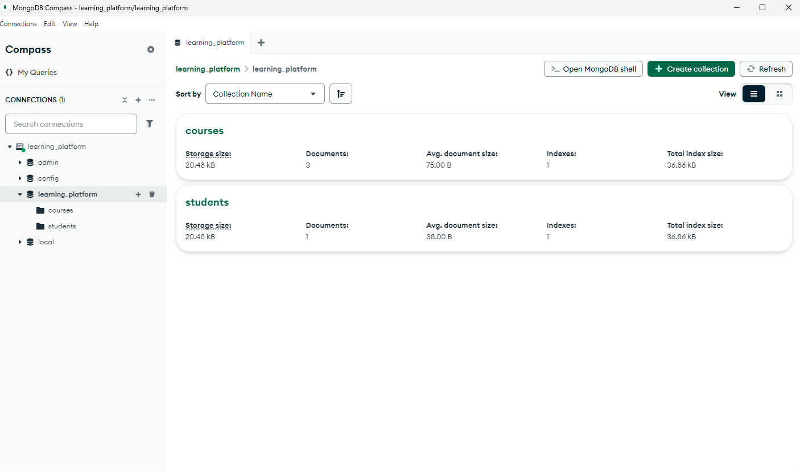
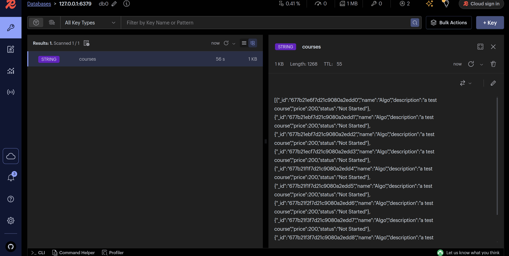

# Projet de fin de module NoSQL

Mini API qui va servir de backend à une plateforme d'apprentissage en ligne.

## Comment Configurer et Installer le Projet

1. Cloner project localement :

   ```bash
   git clone git@github.com:achrafhardizi/learning-platform-nosql.git
   ```

2. Installation des dépendances :

   ```bash
   npm install
   ```

3. Creer fichier `.env` (dans projet racine) :

4. Ajouter String de connection MongoDb dans `.env` :

   ```env
   MONGODB_URI=<Connection-String>
   ```

5. Installer Redis et assurer que le service est en cours d'execution

6. Executer Projet

   ```bash
   npm start
   ```

## Structure Du Project

src/
├── config/        # Configuration et variables d'environnement
├── controllers/   # Logique de contrôle des routes
├── routes/        # Définition des routes API
├── services/      # Logique métier
├── app.js         # Point d'entrée de l'application
└── swagger.js     # Documentation de API

## Choix Techniques

- Node.js et Express: Pour la création d'un serveur backend performant et flexible
- MongoDB: Pour la gestion des données
- Swagger: API Documentation
- dotenv: Pour la gestion des variables d'environnement

## Screenshots du Projet



Caption : Creation des Collection dans MongoDB



Caption : Redis Caching
